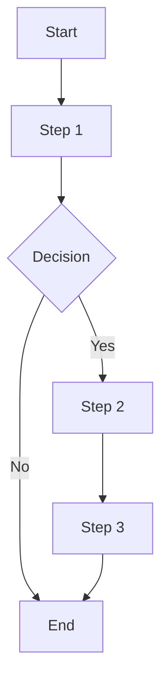


# 学习 99 行拓扑优化代码



```matlab
x(1:nely,1:nelx) = volfrac;
```
- 初始化一个矩阵 `x`。这个矩阵表示拓扑优化问题中的设计变量（通常为材料密度），其中每个元素的初始值都设置为 `volfrac`。
- `1:nely` 和 `1:nelx` 是行和列的索引范围，分别表示从第 1 行到第 `nely` 行、从第 1 列到第 `nelx` 列。
- 通过这种索引方式，`x(1:nely, 1:nelx)` 表示选取矩阵 `x` 中从第 1 行到第 `nely` 行、从第 1 列到第 `nelx` 列的所有元素。由于 `x` 是一个尚未初始化的矩阵，这行代码实际上是定义了一个大小为 `nely x nelx` 的矩阵 `x`。
- `= volfrac;`这部分语句将矩阵 `x` 的所有选定元素赋值为 `volfrac`。`volfrac` 是一个标量，表示材料体积分数。通过这行代码，`x` 矩阵的每个元素都被初始化为 `volfrac` 的值。
- 每个元素是一个**单元**，在这里可以想象成一个小正方形，`volfrac`影响这个小正方形的颜色。单元的顶点是**节点**，所以节点有`(nely+1)(nelx+1)`个
```matlab
change = 1.;
```
- \1. 表示浮点数 1.0，即使没有写出完整的小数部分（.0），MATLAB 仍然将其视为浮点数。
- change 变量用于控制迭代的停止条件。它初始化为一个非零值（如 1.0）。随后，在每次迭代结束时，change 会被重新计算，以反映当前迭代中设计变量的变化程度。

```matlab
while change > 0.01
  loop = loop + 1;
  xold = x;
  ......
end
```

```matlab
% 有限元分析
  [U]=FE(nelx,nely,x,penal);  
```
- 方括号 [] 用于定义函数的输出变量。在这个例子中，U 是 FE 函数的输出变量。因为只有一个输出，U 也是一个单一变量。方括号在这种情况下并不是严格必要的，但在 MATLAB 中，即使只有一个输出变量，使用方括号也是一种常见的习惯。
- 这一行代码的作用是调用 FE 函数，将设计域的尺寸（nelx 和 nely）、设计变量矩阵 x 以及惩罚因子 penal 作为输入，计算结构在当前设计状态下的位移场，并将结果存储在变量 U 中。

```matlab
function [KE]=lk
E = 1.; 
nu = 0.3;
k=[ 1/2-nu/6   1/8+nu/8 -1/4-nu/12 -1/8+3*nu/8 ... 
   -1/4+nu/12 -1/8-nu/8  nu/6       1/8-3*nu/8];
KE = E/(1-nu^2)*[ k(1) k(2) k(3) k(4) k(5) k(6) k(7) k(8)
                  k(2) k(1) k(8) k(7) k(6) k(5) k(4) k(3)
                  k(3) k(8) k(1) k(6) k(7) k(4) k(5) k(2)
                  k(4) k(7) k(6) k(1) k(8) k(3) k(2) k(5)
                  k(5) k(6) k(7) k(8) k(1) k(2) k(3) k(4)
                  k(6) k(5) k(4) k(3) k(2) k(1) k(8) k(7)
                  k(7) k(4) k(5) k(2) k(3) k(8) k(1) k(6)
                  k(8) k(3) k(2) k(5) k(4) k(7) k(6) k(1)];
```
- 这个函数 lk 计算的是一个二维四节点正方形单元的刚度矩阵（stiffness matrix），该矩阵在有限元分析中用于描述单元的弹性行为。
- 这个函数 lk 没有输入参数，返回一个 8x8 的刚度矩阵 KE，这个矩阵表示单个四节点正方形单元在平面应变条件下的弹性刚度。
- E：定义了材料的弹性模量（Young's modulus）。在这个例子中，E = 1，代表一个单位化的弹性模量。
- nu：定义了材料的泊松比（Poisson's ratio）。泊松比 nu = 0.3 是材料的一种弹性性质，反映了材料在拉伸或压缩时的横向变形与轴向变形的比例。
- k 是一个向量，存储了单元刚度矩阵的某些关键系数，这些系数基于材料属性 E 和 nu 计算得出。
- 这个向量 k 包含了在生成刚度矩阵时所需的8个元素。这些元素是根据材料属性和单元几何形状导出的。
- KE 矩阵的元素由向量 k 中的值填充，排列顺序遵循单元的对称性和力学平衡条件。
- 矩阵 KE 是一个 8x8 的对称矩阵，它的元素描述了单元节点之间的刚度关系。这里的 8 表示四节点单元在二维平面内的自由度总数（每个节点有 2 个自由度：x 和 y）。
- 刚度矩阵 KE 是有限元分析中的核心，表示单个单元的力学响应。这个矩阵乘以节点位移向量，产生单元的内力向量。
- 在整个结构中，所有单元的刚度矩阵会被组合成全局刚度矩阵，最终用于求解结构在外部载荷下的位移场。
```matlab
function [U]=FE(nelx,nely,x,penal)
[KE] = lk; 
K = sparse(2*(nelx+1)*(nely+1), 2*(nelx+1)*(nely+1));
F = sparse(2*(nely+1)*(nelx+1),1); U = zeros(2*(nely+1)*(nelx+1),1);
```
- K: 初始化一个稀疏矩阵 K，这是整个结构的全局刚度矩阵。矩阵维度是 2*(nelx+1)*(nely+1)，因为对于每个节点有两个自由度（x 和 y 方向）。
- F: 初始化一个稀疏载荷向量 F，用于存储施加在结构上的外部载荷。
- U: 初始化一个零位移向量 U，用于存储计算后的结构位移。

```matlab
for elx = 1:nelx
  for ely = 1:nely
    n1 = (nely+1)*(elx-1)+ely; 
    n2 = (nely+1)* elx   +ely;
```
- 对于第 (ely,elx) 这个**单元**，我们计算他的左下角和右下角**节点**的全局编号，记作 n1 和 n2。
- 这里全局编号的顺序是先从上到下数完第一列，再从上到下数完第二列，以此类推。
- 通过 n1 和 n2可以确定该单元的节点在全局刚度矩阵中的位置。

```matlab
    edof = [2*n1-1; 2*n1; 2*n2-1; 2*n2; 2*n2+1; 2*n2+2; 2*n1+1; 2*n1+2];
```
- edof 是一个向量，包含当前单元的 8 个自由度（Degrees of Freedom,DOFs）的全局索引。
- 每个节点在二维问题中有两个自由度（x 和 y 方向），所以自由度的索引是节点编号的 2 倍减 1 和 2 倍。
- edof 中的元素按顺序排列，这些索引将用于在全局刚度矩阵 K 中定位当前单元的刚度贡献。

```matlab
    K(edof,edof) = K(edof,edof) + x(ely,elx)^penal*KE;
  end
end
```
- 通过 edof 索引，提取或更新全局刚度矩阵 K 中与当前单元相关的部分。
- x(ely,elx) 是当前单元在设计变量矩阵中的值，表示该单元的材料密度或类似属性。
- penal 是惩罚因子，用于 SIMP 方法中的材料插值。x(ely,elx)^penal 表示将材料密度加权后与单元刚度矩阵 KE 相乘，从而影响材料属性对刚度的贡献。
- 结果是将加权后的单元刚度矩阵 KE 添加到全局刚度矩阵 K 中的相应位置。
- 这段代码的作用是将设计域中的每个单元的刚度矩阵 KE 组装到全局刚度矩阵 K 中。通过循环遍历每个单元，计算其节点的全局自由度索引，并将加权后的单元刚度矩阵 KE 添加到全局刚度矩阵 K 中。这是有限元分析中的关键步骤，因为全局刚度矩阵 K 是求解结构位移的基础。

```matlab
% DEFINE LOADS AND SUPPORTS (HALF MBB-BEAM)
F(2,1) = -1;
```
- F 是载荷向量，表示作用在结构上的外部力。它的大小和方向与结构的自由度相关联。
- 这里定义了在 F 向量的第二个自由度（通常对应于第一个节点的 y 方向）上施加一个大小为 -1 的力，即向下的单位力。这通常用于模拟梁的受力情况。
```matlab
fixeddofs   = union([1:2:2*(nely+1)],[2*(nelx+1)*(nely+1)]);
```
-fixeddofs 是一个向量，包含了所有被固定的自由度的索引。这些自由度对应于结构中被固定不动的节点。
-[1:2:2*(nely+1)] 表示左侧边缘的所有节点在 x 方向（水平）的自由度。这部分定义了所有左侧节点的水平位移为零。
-[2*(nelx+1)*(nely+1)] 表示右侧下角节点在 y 方向（垂直）的自由度，这通常用来防止结构在竖直方向上产生刚体平动。
-union 函数将这两个自由度集合合并，以确保所有需要固定的自由度都包含在 fixeddofs 中。
```matlab
alldofs     = [1:2*(nely+1)*(nelx+1)];
```
- alldofs 是一个向量，包含了结构中所有节点的自由度索引。在二维情况下，每个节点有两个自由度（x 和 y 方向），因此总的自由度数为 2 * (nely+1) * (nelx+1)。
```matlab
freedofs    = setdiff(alldofs,fixeddofs);
```
freedofs 是所有未被固定的自由度的集合。
使用 setdiff 函数计算所有自由度 alldofs 与固定自由度 fixeddofs 的差集，得到的结果就是自由度 freedofs。这些自由度对应于结构中可以自由变形的节点。

```matlab
U(freedofs,:) = K(freedofs,freedofs) \ F(freedofs,:);      
U(fixeddofs,:)= 0;
```
- 这一步使用 MATLAB 的线性求解器 \ 求解线性方程组 K * U = F，求解的结果是自由度 freedofs 对应的位移 U。
- 将固定自由度的位移 U(fixeddofs,:) 设为零，以满足边界条件。因为这些自由度是固定的，所以它们的位移被强制为零。

```matlab
  [U]=FE(nelx,nely,x,penal);
% OBJECTIVE FUNCTION AND SENSITIVITY ANALYSIS
  [KE] = lk;
  c = 0.;
```
初始化目标函数 c 为 0。目标函数通常代表结构的柔度，或者是总的合力位移乘积（即柔度的衡量）。
```matlab
  for ely = 1:nely
    for elx = 1:nelx
      n1 = (nely+1)*(elx-1)+ely; 
      n2 = (nely+1)* elx   +ely;
      Ue = U([2*n1-1;2*n1; 2*n2-1;2*n2; 2*n2+1;2*n2+2; 2*n1+1;2*n1+2],1);
```
- 从全局位移向量 U 中提取当前单元的局部位移向量 Ue。
- 该向量包含了与单元相关的 8 个自由度的位移（4 个节点，每个节点 2 个自由度）。
```matlab
      c = c + x(ely,elx)^penal*Ue'*KE*Ue;
```
- x(ely,elx)^penal：当前单元的材料密度的惩罚值，用于 SIMP 方法中的材料插值。
- Ue' * KE * Ue：当前单元的柔度贡献，即变形能。
- c = c + ...：将所有单元的柔度贡献累加，得到整个结构的总柔度（目标函数值）。
```matlab
      dc(ely,elx) = -penal*x(ely,elx)^(penal-1)*Ue'*KE*Ue;
    end
  end
```
dc(ely,elx)：灵敏度矩阵，表示设计变量 x(ely,elx) 的微小变化对目标函数 c 的影响。
计算结果保存在灵敏度矩阵 dc 中，这些值将在优化过程中用于更新设计变量。

```matlab
% FILTERING OF SENSITIVITIES
  [dc]   = check(nelx,nely,rmin,x,dc);    

  function [dcn]=check(nelx,nely,rmin,x,dc)
dcn=zeros(nely,nelx);
for i = 1:nelx
  for j = 1:nely
    sum=0.0; 
    for k = max(i-floor(rmin),1):min(i+floor(rmin),nelx)
      for l = max(j-floor(rmin),1):min(j+floor(rmin),nely)
        fac = rmin-sqrt((i-k)^2+(j-l)^2);
        sum = sum+max(0,fac);
        dcn(j,i) = dcn(j,i) + max(0,fac)*x(l,k)*dc(l,k);
      end
    end
    dcn(j,i) = dcn(j,i)/(x(j,i)*sum);
  end
end
```
- 这个函数 check 在拓扑优化中用于实现灵敏度的滤波处理（sensitivity filtering），其目的是减少优化过程中数值噪声的影响，并确保生成的结构具有网格无关性（即结构特征尺寸不会随网格尺寸变化）。
- check 函数通过一种称为“均值滤波”（mean filtering）的技术，对设计变量的灵敏度进行平滑处理。这样做的目的是避免优化结果过度依赖局部的、可能不真实的灵敏度值，从而确保优化结果的合理性和稳定性。
- 这里的两个嵌套循环 k 和 l 用于遍历单元 (i, j) 周围的一个区域，范围由 rmin 决定。
- max(i-floor(rmin),1) 和 min(i+floor(rmin),nelx) 确定了邻域在 x 方向上的范围；同理，max(j-floor(rmin),1) 和 min(j+floor(rmin),nely) 确定了邻域在 y 方向上的范围。
- fac = rmin-sqrt((i-k)^2+(j-l)^2): 计算加权因子 fac，这个因子根据距离 (i, j) 单元的距离来计算。离得越近，加权因子越大。
- sum = sum + max(0,fac): 累加所有正的加权因子。
- dcn(j,i) = dcn(j,i) + max(0,fac) * x(l,k) * dc(l,k);: 滤波后的灵敏度 dcn(j,i) 是加权因子 fac、邻域单元的材料密度 x(l,k) 和原始灵敏度 dc(l,k) 的加权和。
- 滤波后的灵敏度 dcn(j,i) 被归一化，即除以加权因子总和 sum，确保滤波结果与设计变量的物理含义一致。
- check 函数的主要作用是对灵敏度进行滤波处理，通过考虑每个单元周围一定半径内的邻域，计算出加权平均的灵敏度值，从而减少数值噪声对优化结果的影响。这样，生成的结构特征更为平滑和合理，有助于实现拓扑优化中所需的网格无关性。这种滤波处理在拓扑优化中非常常见，尤其是在处理高分辨率网格或存在较大数值噪声的情况下。

```matlab
% DESIGN UPDATE BY THE OPTIMALITY CRITERIA METHOD
  [x]    = OC(nelx,nely,x,volfrac,dc); 

  function [xnew]=OC(nelx,nely,x,volfrac,dc)  
l1 = 0; l2 = 100000; move = 0.2;

```
- 这个函数 OC 是用于拓扑优化中的最优性准则法（Optimality Criteria Method）的实现。最优性准则法是一种常用的更新设计变量的方法，目的是在给定约束（如体积约束）下最小化目标函数（如结构柔度）。函数 OC 通过迭代调整设计变量 x，使得新的设计变量 xnew 满足约束条件，并向最优解逼近。
- 函数 OC 通过迭代的方法调整设计变量 x，使得目标函数（通常是结构柔度）最小化，同时满足体积约束 volfrac。它使用二分法来找到合适的 Lagrange 乘子，使得设计变量的更新既满足体积约束，又保证优化方向（由灵敏度 dc 确定）是合理的。
- l1 和 l2: 分别是拉格朗日乘子的初始下界和上界。拉格朗日乘子用于控制设计变量更新过程中约束条件的满足。
- move: 设计变量每次更新时的最大变化量，用于限制设计变量的变化范围，从而避免数值不稳定性。
```matlab
while (l2-l1 > 1e-4)
  lmid = 0.5*(l2+l1);
  xnew = max(0.001,max(x-move,min(1.,min(x+move,x.*sqrt(-dc./lmid)))));
```
- 这行代码是设计变量 x 的更新公式，基于当前的设计变量 x 和灵敏度 dc。
- x.*sqrt(-dc./lmid): 根据最优性准则法的公式，计算新的设计变量值。dc 是灵敏度，lmid 是当前的拉格朗日乘子。
- min(x+move, ...) 和 max(x-move, ...): 通过限制 x 的变化量，确保设计变量在每次迭代中不会有过大的变化。
- max(0.001, ...): 确保设计变量不会小于一个最小值 0.001，避免数值上出现完全为空的单元。
- min(1., ...): 确保设计变量不会超过最大值 1，即材料密度不会超过完全密实的情况。
```matlab
  if sum(sum(xnew)) - volfrac*nelx*nely > 0;
    l1 = lmid;
  else
    l2 = lmid;
  end
end
```
- sum(sum(xnew)) 计算更新后的设计变量矩阵 xnew 的总材料体积。
- 体积约束: 如果新的总材料体积大于允许的体积（volfrac*nelx*nely），说明材料用量超过了限制，需要增加拉格朗日乘子 l1，从而减少下一次迭代中的材料密度。
- 如果材料体积小于或等于限制，则减少拉格朗日乘子 l2，从而增加下一次迭代中的材料密度。
- 使用二分法迭代调整拉格朗日乘子 lmid，直到上下界之间的差值小于给定的阈值 1e-4，即认为找到合适的 lmid。
```matlab
% PRINT RESULTS
  change = max(max(abs(x-xold)));
```
- 这行代码计算了当前迭代中设计变量矩阵 x 的最大变化量。
- xold: 前一轮迭代的设计变量矩阵。
- x: 当前迭代后的设计变量矩阵。
- abs(x-xold): 计算设计变量矩阵每个元素的绝对差值。
- max(max(...)): 找出这些差值中的最大值，即当前设计中变化最大的地方。这一值用于判断优化是否已经收敛（变化量足够小）。
```matlab
  disp([' It.: ' sprintf('%4i',loop) ' Obj.: ' sprintf('%10.4f',c) ...
       ' Vol.: ' sprintf('%6.3f',sum(sum(x))/(nelx*nely)) ...
        ' ch.: ' sprintf('%6.3f',change )])
```
- 这行代码使用 disp 函数打印当前迭代的一些关键信息。
- It.:: 打印当前的迭代次数 loop，使用 sprintf('%4i',loop) 将 loop 格式化为宽度为 4 的整数。
- Obj.:: 打印当前的目标函数值 c，使用 sprintf('%10.4f',c) 格式化为宽度为 10，小数点后保留 4 位的浮点数。
- Vol.:: 打印当前的材料体积分数，即设计变量矩阵 x 的平均值 sum(sum(x))/(nelx*nely)。这个值表示材料在整个设计域中的占比。
- ch.:: 打印设计变量的最大变化量 change，同样格式化为小数点后 3 位的浮点数。
- 这些信息对于跟踪优化过程非常重要，能够帮助判断优化是否在朝着预期方向进行，是否接近收敛。
```matlab
% PLOT DENSITIES  
  colormap(gray); imagesc(-x); axis equal; axis tight; axis off;pause(1e-6);
```
- colormap(gray);: 设置绘图的颜色映射为灰度图。这意味着密度较高的区域会显示为较深的灰色，而密度较低的区域会显示为较浅的灰色或白色。
- imagesc(-x);: 绘制设计变量矩阵 x 的图像，其中 -x 表示将 x 取反。取反的目的是将高密度（接近 1）显示为深色，低密度（接近 0）显示为浅色，这样更符合人类视觉直觉。
- axis equal;: 设置坐标轴比例相同，这样图像不会因为比例问题而变形。
- axis tight;: 去除多余的空白区域，使图像紧凑显示。
- axis off;: 隐藏坐标轴。
- pause(1e-6);: 暂停一小段时间（非常短暂），以确保图像有足够时间更新。这在动画效果中尤其重要。

