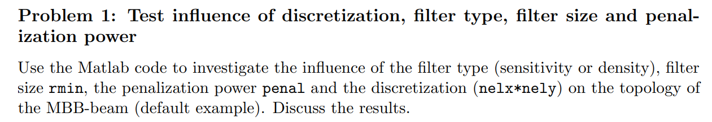

<script type="text/javascript" async
  src="https://cdn.jsdelivr.net/npm/mathjax@3/es5/tex-mml-chtml.js">
</script>
# Problem 1: Test influence of discretization, filter type, filter size and penalization power

<p align="center">
  <figure align="center">
    
  </figure>
</p>

- **Design domain**: A rectangle with an aspect ratio of 3:1, representing half of an MBB beam.
- **Boundary conditions**: The x-component on the left edge is fixed, and the y-component at the bottom right corner is fixed.
```matlab
fixeddofs = union([1:2:2*(nely+1)],[2*(nelx+1)*(nely+1)]);
```
- **Loading conditions**: A vertical downward force is applied at the top-left corner.
```matlab
F = sparse(2,1,-1,2*(nely+1)*(nelx+1),1);
```
## Optimization Model: SIMP
The SIMP (Solid Isotropic Material with Penalization) method is a widely used approach in topology optimization. It defines the material properties as a function of the design variables, typically representing material density. The method penalizes intermediate densities to push the design towards a clear distinction between solid and void regions, enabling efficient and manufacturable structures. The primary goal of SIMP is to optimize material distribution within a given design domain to achieve maximum stiffness under specified constraints.
- **Design Variable**: Material density `x`, where `x` ranges from 0 to 1, with 0 indicating void and 1 indicating solid material. In the code, `x` is implemented as an `nely` by `nelx` matrix, where each element represents the density of a specific element in the design domain. The values of this matrix are initially set to `volfrac`, the prescribed volume fraction, to ensure a uniform distribution of material density at the start of the optimization process.
- **Objective Function**: Minimize compliance (maximize stiffness) of the structure, represented as

$$c(x)=U^TKU=\sum_{e=1}^{\rm nelx\times nely}E_e(x_e)U_e^TK_0U_e,\quad E_e(x_e)=\begin{cases}x_e^p&\text{in 99-line code}\\E_{\rm min}+x_e^p(E_0-E_{\rm min})&\text{in 88-line code}\end{cases}$$

- **Constraint**: The problem imposes a volume constraint, ensuring that the material used in the optimized structure does not exceed the initially specified volume fraction. This constraint is expressed as:

$$\sum_{e=1}^{\rm nely\times nelx}x_e<{\rm volfrac}\times {\rm nelx}\times {\rm nely}.$$

## Sensitivity Analysis
In the context of topology optimization, sensitivity analysis is essentially the process of calculating the derivative of the objective function with respect to the design variables. This derivative, or sensitivity, provides the necessary information to guide the optimization process, ensuring that updates to the design variables are made in a direction that drives the solution toward an optimal configuration.

$$\begin{align*}
\frac{\partial c}{\partial x_e}&=\frac{\partial U^T}{\partial x_e}KU+U^T\frac{\partial K}{\partial x_e}U+U^TK\frac{\partial U}{\partial x_e}=U^T\frac{\partial K}{\partial x_e}U+2U^TK\frac{\partial U}{\partial x_e} \\
&=U^T\frac{\partial K}{\partial x_e}U-2U^TKK^{-1}\frac{\partial K}{\partial x_e}U=-U^T\frac{\partial K}{\partial x_e}U=-p x_e^{p-1}（E_0-E_{\min}） U_e^T K_0 U_e
\end{align*}$$

When I first saw \\(-p x_e^{p-1}(E_0-E_{\min})\\), my initial reaction was that this term comes from the derivative of \\(E_e(x_e)\\) with respect to \\(x_e\\), with an extra negative sign added for some reason unknown to me. As a result, I mistakenly interpreted the \\(\text{dc}\\) in the code as the negative of the derivative of \\(c\\) with respect to \\(x\\). However, in reality, \\(U_e\\) also contains the dependency of \\(c\\) on \\(x\\), and when all these dependencies are taken into account, the correct result just happens to introduce a negative sign. This means that \\(\text{dc}\\) is indeed the derivative of \\(c\\) with respect to \\(x\\), not the negative of the derivative as I initially understood.

We can see that derivatives of compliance with respect to every position are all negative. This property reflects the fact that increase of element densities always leads to less compliant structure.


## Optimization Algorithm: Optimality Criteria (OC)

The Optimality Criteria (OC) method is the core optimization algorithm used in this code to iteratively adjust the design variables, guiding the solution towards optimality. In each iteration, the OC method updates the design variables x to minimize the objective function (compliance) while ensuring the volume constraint is met. This process is governed by the Lagrangian function, which integrates the objective with the optimization constraints.

 $$\mathcal{L} = c + \lambda\left(\sum_{e}^{\rm nely\times nelx} x_e - {\rm volfrac}\times {\rm nelx}\times {\rm nely}\right) + \sum_{e} \lambda_e^+ (x_e - 1) + \sum_{e} \lambda_e^- (x_{\text{min}} - x_e).$$

The Karush-Kuhn-Tucker (KKT) Condition of this Lagrangian function reads

$$ \frac{\partial c}{\partial x_e}+\lambda+\sum_e\lambda_e^+-\sum_e\lambda_e^-=0 $$

The idea of the Optimality Criteria (OC) method is to approximate \\(c\\) for a given initial guess solution \\(x_0\\) by

$$ \tilde{c}_{x_0}(x)=c(x_0)-\sum_{e}\frac{\partial c}{\partial x_e}(x_0)x^2_{e0}\left(\frac{1}{x_e}-\frac{1}{x_{e0}}\right),\quad \frac{\partial \tilde{c}_{x_0}}{\partial x_e}=\frac{\partial c}{\partial x_e}(x_0)\frac{x^2_{e_0}}{x_e^2} $$

Then we have new KKT condition for new Lagrangian reads

$$ \frac{\partial c}{\partial x_e}(x_0)\frac{x^2_{e_0}}{x_e^2}+\lambda+\sum_e\lambda_e^+-\sum_e\lambda_e^-=0\Longrightarrow x_e=\sqrt{\frac{B_e}{\tilde{\lambda}}}x_{e0},\quad B_e=-\frac{\partial c}{\partial x_e}(x_0),\quad \tilde{\lambda}=\lambda+\sum_e\lambda_e^+-\sum_e\lambda_e^- $$

This way, we obtain a better solution \\(x_1\\) from the initial guess \\(x_0\\), and then \\(x_1\\) in turn becomes the new guess for the next iteration, thus starting the iterative process. In practice, \\(x_0\\) is typically chosen as a uniform distribution, and we constrain each iteration step so that the change does not exceed a specified value \\( \text{move} \\), while also ensuring that the result remains within the bounds of 0 and 1. This leads to the code implementation of

$$ x_{\text{new}} = \max\left(0, \max\left(x - \text{move}, \min\left(1, \min\left(x + \text{move}, x \cdot \sqrt{\frac{-dc}{dv \cdot \lambda}}\right)\right)\right)\right) $$

In practice, we also need to apply an additional filtering step to \\(dc\\) and \\(dv\\) to avoid numerical instability and mesh dependency issues, which will be discussed in detail in later sections. We use the bisection method to find the value of \\(\lambda\\) to satisfy the volume constraint. The iterative process continues until the maximum change in the design variables between iterations falls below a specified threshold (e.g., 0.01). This indicates that the solution has converged to a near-optimal design.

We haven't provided a formal proof that \\(x_1\\) is better than \\(x_0\\), but I can offer some intuitive explanations. The total volume remains constant before and after the iteration, so the density increases in some positions and decreases in others. The total increase in density equals the total decrease. The factor \\(\lambda\\) serves as a common coefficient and can be disregarded for now. The degree of increase or decrease in each position is directly proportional to the square root of \\(-dc\\), which in turn is proportional to the absolute value of the derivative of the objective function with respect to that position. Thus, positions where the material density increases have a higher absolute value of the derivative compared to positions where the density decreases. According to sensitivity analysis, this means the objective function is more sensitive to changes in these positions. Therefore, even though the total increase in density equals the total decrease, the effect on the objective function from the increase is greater than that from the decrease. Since an increase in material density corresponds to a decrease in the objective function, the value of the objective function will be lower after the iteration.

## Filter type: Sensitivity Filtering
In topology optimization, filtering plays a critical role in ensuring the stability and physical meaningfulness of the optimization process. Without filtering, the optimization algorithm can produce results that exhibit numerical instabilities, such as the formation of "checkerboard" patterns or other non-physical artifacts. These issues arise because the optimization can exploit the high sensitivity of certain elements to create designs that are mathematically optimal but physically unrealistic. Filtering smooths out these variations by considering the influence of neighboring elements, thereby promoting a more stable and reliable convergence toward a manufacturable design.

In Sensitivity Filtering, we first define a sparse matrix \\( H \\), which provides the weights for performing a weighted average of the values at a point with the values of points in a nearby region selected in a certain manner. The method for selecting the region and the weighting of the values can be adjusted according to your specific needs.

In Sensitivity Filtering, the object being weighted is the sensitivity \\( dc \\). First, \\( dc \\) is multiplied by \\( x \\) at each position, and the resulting product is then multiplied by the matrix \\( H \\). This result is then divided by the normalization factor \\( Hs \\), and finally, each position is divided by \\( x \\). Thus, we effectively perform two layers of weighting: the first layer reduces the influence of positions with low material density, and the second layer averages each point with the surrounding positions.

In practice, we divide each position by the larger value between \\(1e-3\\) and \\(x\\) to avoid division by zero.
```matlab
if ft == 1
  dc(:) = H*(x(:).*dc(:))./Hs./max(1e-3,x(:));
end
```


## Filter type: Density Filtering
Compared to Sensitivity Filtering, Density Filtering simplifies the processing of \\(dc\\) by removing one layer of weighting by \\(x\\), using only the matrix \\(H\\) to weight \\(dc\\). However, Density Filtering introduces an additional step: when using the bisection method to find the value of \\(\lambda\\), it compares the volume of \\(x_{\text{Phys}}\\) (the weighted result of \\(x_{\text{new}}\\) by \\(H\\)) with the volume constraint, rather than comparing the volume of \\(x_{\text{new}}\\) calculated using the previous \\(\lambda\\). Nonetheless, the value used to update \\(x\\) is still \\(x_{\text{new}}\\), not the weighted average \\(x_{\text{new}}\\). The purpose of this operation remains somewhat mysterious to me.

## Results Comparison and Analysis
To develop an intuitive understanding of topology optimization, we selected 162 parameter combinations for testing, aiming to cover a wide range of configurations as comprehensively as possible. Specifically, we chose the following parameter combinations:

- **nelx = 60, 120, 240**: representing mesh refinement from coarse to fine.
- **volfrac = 0.2 and 0.5**: reflecting the behavior under two different material volume fractions.
- **penal = 1, 3, 5**: corresponding to low, medium, and high levels of the penalization factor.
- **rmin = 2.4, 4.8, 9.6**: representing different filter radii.
- **ft = 0, 1, 2**: with ft=0 as a control group, indicating the case with no filtering.

Through these parameter combinations, we can examine the impact of different parameters on the optimization results. Next, we will present and analyze several representative results.
### Influence of the filter type

<p align="center">
  <figure align="center">
    
    <figcaption>From left to right: ft = 0, 1, 2; from top to bottom: nelx = 60, 120, 240; rmin = 2.4, 4.8, 9.6. Other parameters: volfrac = 0.5, penal = 3</figcaption>
  </figure>
</p>

It can be seen that compared to ft=0, which represents the case without filtering, both filtering types, ft=1 and ft=2, provide a significantly smoother effect. The angles of the slanted edges in ft=1 appear to be smaller, but from other perspectives, it is difficult to distinguish the differences between the two results with the naked eye.

<div style="text-align: center;">
    <table border="1" style="margin: auto；" width='60%'>
        <tr>
            <th>c</th>
            <th>nelx=60</th>
            <th>nelx=120</th>
            <th>nelx=240</th>
            <th>loop</th>
            <th>nelx=60</th>
            <th>nelx=120</th>
            <th>nelx=240</th>
        </tr>
        <tr>
            <td><strong>ft=1</strong></td>
            <td>216.8137</td>
            <td>219.1707</td>
            <td>221.4852</td>
            <td><strong>ft=1</strong></td>
            <td>106</td>
            <td>93</td>
            <td>93</td>
        </tr>
        <tr>
            <td><strong>ft=2</strong></td>
            <td>233.7146</td>
            <td>236.2088</td>
            <td>237.4982</td>
            <td><strong>ft=2</strong></td>
            <td>144</td>
            <td>158</td>
            <td>1020</td>
        </tr>
    </table>
</div>

It can be seen from the table that ft=1 consistently achieves lower objective function values compared to ft=2 across all grid resolutions. This suggests that ft=1 might be more effective in achieving a more optimal structural design, as lower objective function values typically indicate better performance. Besides, ft=1 converges much faster than ft=2, especially noticeable at the highest grid resolution (nelx=240), where ft=2 requires 1020 iterations compared to only 93 for ft=1. This indicates that ft=1 has a clear advantage in terms of convergence speed, leading to quicker optimization with fewer iterations, whereas ft=2 may result in substantially longer computation times, particularly at higher resolutions.


<p align="center">
  <figure align="center">
    
    <figcaption>From top to bottom: ft =  1, 2; from left to right: nelx = 60, 120, 240; rmin = 2.4, 4.8, 9.6. Other parameters: volfrac = 0.5, penal = 5</figcaption>
  </figure>
</p>
However, in the case where penal=5, we can observe that at higher resolutions, the high penalization factor causes unnatural voids in the ft=1 results, while the ft=2 results remain smoother. Therefore, we can infer that ft=2 tends to provide a smoother optimized structure compared to ft=1.

### Influence of the filter size and the discretization


<p align="center">
  <figure align="center">
    
    <figcaption>From left to right: rmin = 2.4, 4.8, 9.6; from top to bottom: nelx = 60, 120, 240. Other parameters: volfrac = 0.5, penal = 3, ft = 1.</figcaption>
  </figure>
</p>

Considering the three rows as three sets of examples and comparing the effects of different filter sizes within the same row, we can observe that the most suitable filter size varies depending on the discretization resolution. If the filter size is too large relative to the discretization resolution, excessive averaging can lead to significant blurring. On the other hand, if the filter size is too small relative to the discretization resolution, it tends to result in more complex topologies with higher genus, and even the appearance of checkerboard patterns.

Considering the three columns as three sets of examples and comparing the effects of different discretization resolutions within the same column, we can observe the so-called mesh dependency. As the discretization resolution increases, the optimized structures become more complex. Although the objective function value may decrease accordingly (for example, in the first column, the final objective function values from top to bottom are 216.8137, 200.7515, and 191.6844), more complex structures are more difficult to realize in engineering practice.

### Influence of the penalization power

<p align="center">
  <figure align="center">
    
    <figcaption>From left to right: penal = 1, 3, 5; from top to bottom: nelx = 60, 120, 240; rmin = 2.4, 4.8, 9.6. Other parameters: volfrac = 0.5, ft = 1</figcaption>
  </figure>
</p>
The purpose of introducing the penalization power is to push grayscale values towards either 0 or 1. The visual results in the images confirm this: too low a penalization power results in large areas of gray remaining in the optimized design, while too high a penalization power leads to unnatural voids in the optimized structure.

## Comments and Conclusion
I invested a significant amount of effort in Problem 1, trying to thoroughly understand the algorithm behind the 88 lines of code, particularly the origins and workings of the Optimality Criteria (OC) method. I believe these efforts are worthwhile and will make future learning more efficient. I experimented with as many parameter combinations as possible to observe their impact on the final optimized structure. Although I encountered many cases where the iteration process did not converge, leading to discarded combinations, these failed attempts also contribute to my experience. These experiments have given me a budding intuition for topology optimization.

## Source code
```matlab
function problem1()
    % 初始化Excel数据存储
    results = {};
    results{1, 1} = 'nelx';
    results{1, 2} = 'nely';
    results{1, 3} = 'volfrac';
    results{1, 4} = 'penal';
    results{1, 5} = 'rmin';
    results{1, 6} = 'ft';
    results{1, 7} = 'loop';
    results{1, 8} = 'c';
    
    % 记录结果的行数索引
    row_index = 2;

    % 第一层循环遍历nelx的值
    for nelx = [60, 120, 240]
        nely = nelx / 3;
        
        % 第二层循环遍历volfrac的值
        for volfrac = [0.2, 0.5]
            
            % 第三层循环遍历penal的值
            for penal = [1, 3, 5]
                
                % 第四层循环遍历rmin的值
                for rmin = [2.4, 4.8, 9.6]
                    
                    % 第五层循环遍历ft的值
                    for ft = [0, 1, 2]
                        
                        % 调用top88函数并返回loop和c
                        [loop, c] = top88(nelx, nely, volfrac, penal, rmin, ft);
                        
                        % 将参数和结果存储在results中
                        results{row_index, 1} = nelx;
                        results{row_index, 2} = nely;
                        results{row_index, 3} = volfrac;
                        results{row_index, 4} = penal;
                        results{row_index, 5} = rmin;
                        results{row_index, 6} = ft;
                        results{row_index, 7} = loop;
                        results{row_index, 8} = c;
                        
                        % 更新行索引
                        row_index = row_index + 1;
                    end
                end
            end
        end
    end
    
    % 将结果保存到Excel文件中
    result_table = cell2table(results(2:end,:), 'VariableNames', results(1,:));
    writetable(result_table, 'Problem1_Results.xlsx');
end

function [loop, c] = top88(nelx,nely,volfrac,penal,rmin,ft)
%% MATERIAL PROPERTIES
E0 = 1;
Emin = 1e-9;
nu = 0.3;
%% PREPARE FINITE ELEMENT ANALYSIS
A11 = [12  3 -6 -3;  3 12  3  0; -6  3 12 -3; -3  0 -3 12];
A12 = [-6 -3  0  3; -3 -6 -3 -6;  0 -3 -6  3;  3 -6  3 -6];
B11 = [-4  3 -2  9;  3 -4 -9  4; -2 -9 -4 -3;  9  4 -3 -4];
B12 = [ 2 -3  4 -9; -3  2  9 -2;  4  9  2  3; -9 -2  3  2];
KE = 1/(1-nu^2)/24*([A11 A12;A12' A11]+nu*[B11 B12;B12' B11]);
nodenrs = reshape(1:(1+nelx)*(1+nely),1+nely,1+nelx);
edofVec = reshape(2*nodenrs(1:end-1,1:end-1)+1,nelx*nely,1);
edofMat = repmat(edofVec,1,8)+repmat([0 1 2*nely+[2 3 0 1] -2 -1],nelx*nely,1);
iK = reshape(kron(edofMat,ones(8,1))',64*nelx*nely,1);
jK = reshape(kron(edofMat,ones(1,8))',64*nelx*nely,1);
% DEFINE LOADS AND SUPPORTS (HALF MBB-BEAM)
F = sparse(2,1,-1,2*(nely+1)*(nelx+1),1);
U = zeros(2*(nely+1)*(nelx+1),1);
fixeddofs = union([1:2:2*(nely+1)],[2*(nelx+1)*(nely+1)]);
alldofs = [1:2*(nely+1)*(nelx+1)];
freedofs = setdiff(alldofs,fixeddofs);
%% PREPARE FILTER
iH = ones(nelx*nely*(2*(ceil(rmin)-1)+1)^2,1);
jH = ones(size(iH));
sH = zeros(size(iH));
k = 0;
for i1 = 1:nelx
  for j1 = 1:nely
    e1 = (i1-1)*nely+j1;
    for i2 = max(i1-(ceil(rmin)-1),1):min(i1+(ceil(rmin)-1),nelx)
      for j2 = max(j1-(ceil(rmin)-1),1):min(j1+(ceil(rmin)-1),nely)
        e2 = (i2-1)*nely+j2;
        k = k+1;
        iH(k) = e1;
        jH(k) = e2;
        sH(k) = max(0,rmin-sqrt((i1-i2)^2+(j1-j2)^2));
      end
    end
  end
end
H = sparse(iH,jH,sH);
Hs = sum(H,2);
%% INITIALIZE ITERATION
x = repmat(volfrac,nely,nelx);
xPhys = x;
loop = 0;
change = 1;
objective_history = []; % Initialize the array to store objective function values
%% START ITERATION
while change > 0.01
  loop = loop + 1;
  %% FE-ANALYSIS
  sK = reshape(KE(:)*(Emin+xPhys(:)'.^penal*(E0-Emin)),64*nelx*nely,1);
  K = sparse(iK,jK,sK); K = (K+K')/2;
  U(freedofs) = K(freedofs,freedofs)\F(freedofs);
  %% OBJECTIVE FUNCTION AND SENSITIVITY ANALYSIS
  ce = reshape(sum((U(edofMat)*KE).*U(edofMat),2),nely,nelx);
  c = sum(sum((Emin+xPhys.^penal*(E0-Emin)).*ce));
  dc = -penal*(E0-Emin)*xPhys.^(penal-1).*ce;
  dv = ones(nely,nelx);
  objective_history = [objective_history, c]; % Store current objective function value
  %% FILTERING/MODIFICATION OF SENSITIVITIES
  if ft==0
      % No filtering if ft == 0
  elseif ft == 1
    dc(:) = H*(x(:).*dc(:))./Hs./max(1e-3,x(:));
  elseif ft == 2
    dc(:) = H*(dc(:)./Hs);
    dv(:) = H*(dv(:)./Hs);
  end
  %% OPTIMALITY CRITERIA UPDATE OF DESIGN VARIABLES AND PHYSICAL DENSITIES
  l1 = 0; l2 = 1e9; move = 0.2;
  while (l2-l1)/(l1+l2) > 1e-3
    lmid = 0.5*(l2+l1);
    xnew = max(0,max(x-move,min(1,min(x+move,x.*sqrt(-dc./dv/lmid)))));
    if ft == 0
      xPhys = xnew;
    elseif ft == 1
      xPhys = xnew;
    elseif ft == 2
      xPhys(:) = (H*xnew(:))./Hs;
    end
    if sum(xPhys(:)) > volfrac*nelx*nely, l1 = lmid; else l2 = lmid; end
  end
  change = max(abs(xnew(:)-x(:)));
  x = xnew;
  %% CHECK MAXIMUM NUMBER OF ITERATIONS
  if loop >= 2000
      fprintf('Max iterations reached.\n');
      break;
  end
  %% PRINT RESULTS
  fprintf(' It.:%5i Obj.:%11.4f Vol.:%7.3f ch.:%7.3f\n',loop,c, ...
    mean(xPhys(:)),change);
  %% PLOT DENSITIES
  colormap(gray); imagesc(1-xPhys); caxis([0 1]); axis equal; axis off; drawnow;
end
%% SAVE FINAL STRUCTURE IMAGE
structure_filename = sprintf('Problem1structure_nelx%d_nely%d_volfrac%.2f_penal%.2f_rmin%.2f_ft%d_loop%d_c%.4f.png', ...
    nelx, nely, volfrac, penal, rmin, ft, loop, c);
saveas(gcf, structure_filename);

%% PLOT AND SAVE OBJECTIVE FUNCTION HISTORY
figure;
plot(1:loop, objective_history, '-o', 'LineWidth', 2);
xlabel('Iteration');
ylabel('Objective Function Value');
title('Objective Function vs Iteration');
grid on;
objective_filename = sprintf('Problem1objective_nelx%d_nely%d_volfrac%.2f_penal%.2f_rmin%.2f_ft%d_loop%d_c%.4f.png', ...
    nelx, nely, volfrac, penal, rmin, ft, loop, c);
saveas(gcf, objective_filename);
end
```

