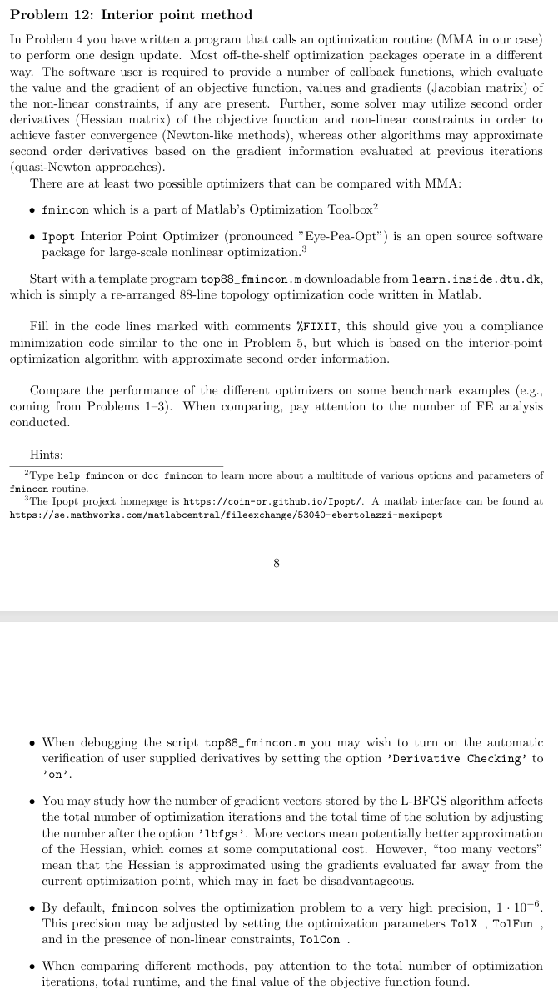
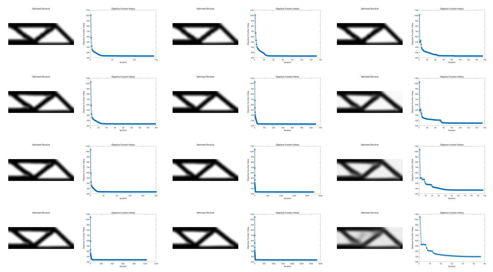
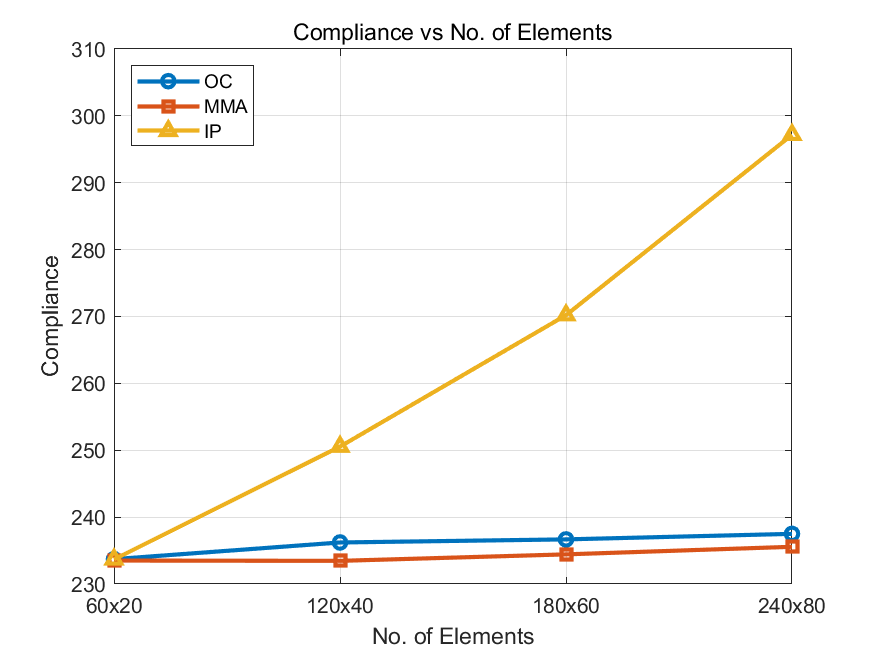
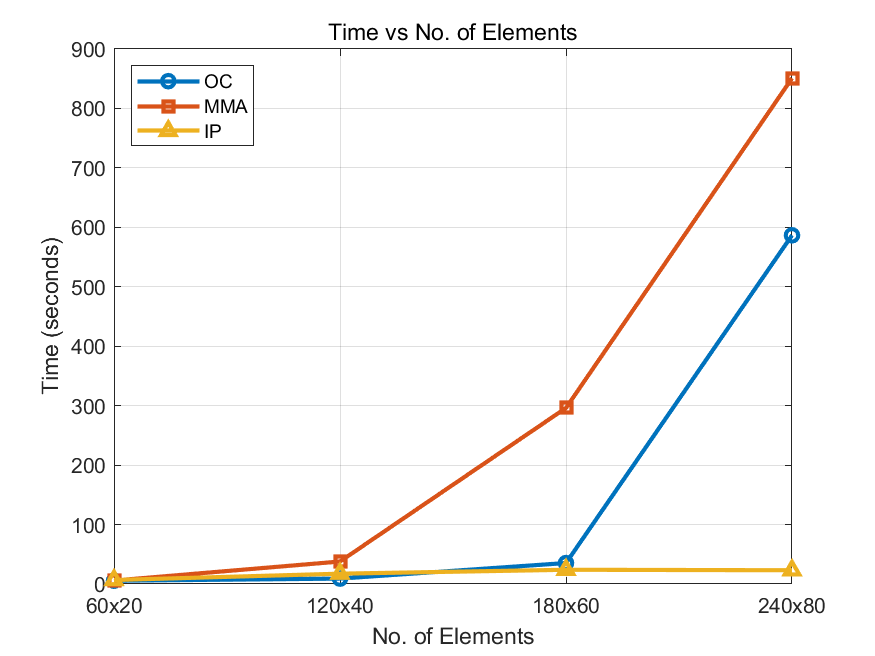

<script type="text/javascript" async
  src="https://cdn.jsdelivr.net/npm/mathjax@3/es5/tex-mml-chtml.js">
</script>
# Problem 12: Interior point method
<figure align="center">
    
  </figure>
In this assignment, we will use the classic MBB beam as an example to compare the performance differences of three different optimization methods: OC, MMA, and IP (Interior Point Method).

## Results Comparison and Analysis
The volfrac is set to 0.5, penal is set to 3, and four groups are prepared with nelx=60, 120, 180, and 240, nely=nelx/3, and rmin=nelx*0.04.
  <figure align="center">
    
  </figure>
  This image corresponds to the optimization results and objective function variation curves for different methods, with nelx=60, 120, 180, and 240 from top to bottom, and OC, MMA, and IP from left to right.
  <figure align="center">
    
  </figure>
  This image illustrates the variation of the objective function value with the increase in the number of elements.
  <figure align="center">
    
  </figure>
  
  This image illustrates the variation in runtime as the number of elements increases.

  Based on the two plots, we can analyze the performance of the three methods — OC (Optimality Criteria), MMA (Method of Moving Asymptotes), and IP (Interior Point Method) — in terms of **compliance** and **time** across different element sizes.

### 1. **Compliance vs. No. of Elements**:
In the first plot, which shows the relationship between **compliance** and the number of elements:
- **OC** and **MMA** exhibit very similar behavior, with both methods having a nearly flat curve. The compliance values increase only slightly as the number of elements grows from `60x20` to `240x80`, indicating that both methods maintain a relatively consistent performance in terms of compliance, regardless of mesh density.
- **IP** shows a significantly different trend. Its compliance values increase sharply as the number of elements increases, particularly between `120x40` and `240x80`. This suggests that the IP method becomes less efficient at minimizing compliance as the problem's complexity increases.

### 2. **Time vs. No. of Elements**:
The second plot shows the computational **time** required by each method:
- **MMA** performs well initially but shows a dramatic increase in computation time as the number of elements grows. Between `180x60` and `240x80`, the time jumps significantly, making MMA the slowest method for the largest problem size.
- **OC** also shows an increase in time, but it performs better than MMA, especially for larger element counts. OC remains more computationally efficient than MMA when handling larger problems.
- **IP**, on the other hand, shows almost no significant increase in time as the number of elements grows. Its time remains relatively constant, indicating a much more stable and scalable computational cost compared to both OC and MMA.

### Summary:
- **Compliance**: Both OC and MMA offer stable compliance performance, with minimal increase in compliance as the number of elements grows. IP, however, suffers from a significant increase in compliance with larger problem sizes, making it less effective in this regard.
- **Time**: IP is the most time-efficient method, showing almost no increase in computational time as problem size increases. OC performs moderately well, with a noticeable but manageable increase in time for larger problems. MMA, however, is the least time-efficient method, showing a significant increase in time as the number of elements increases.

In conclusion, **IP** is the most computationally efficient method in terms of time, but its compliance performance degrades as problem size increases. **OC** provides a good balance between compliance and computational efficiency, making it a reliable choice for larger problems. **MMA** delivers good compliance but is significantly slower for larger problem sizes, making it less suitable for large-scale problems.
## Source code
```matlab

```