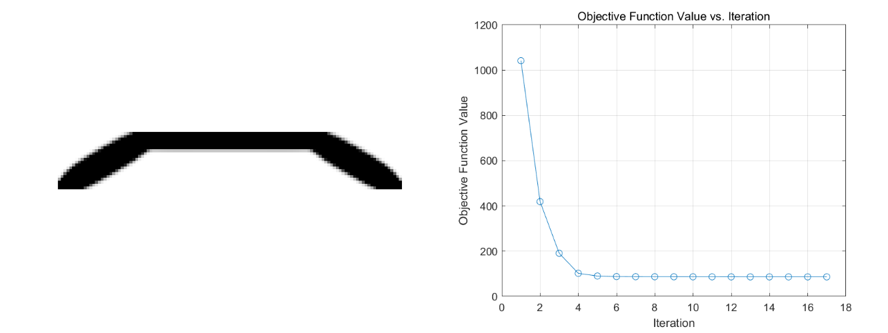
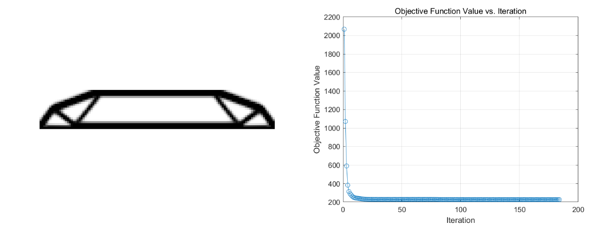
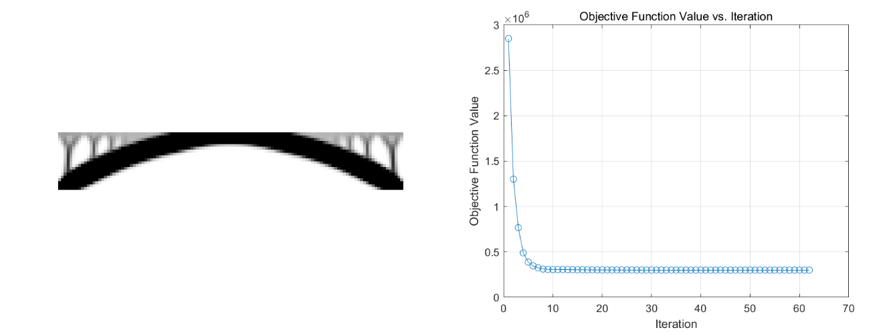
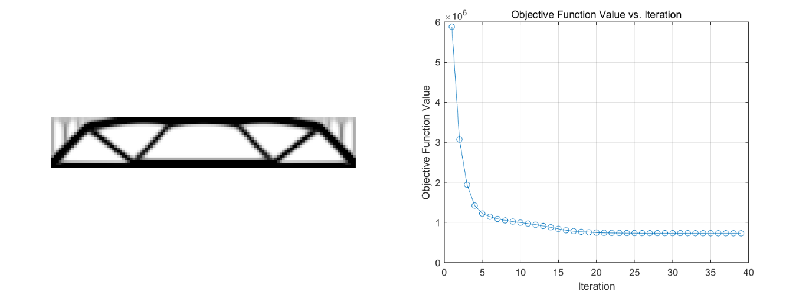

<script type="text/javascript" async
  src="https://cdn.jsdelivr.net/npm/mathjax@3/es5/tex-mml-chtml.js">
</script>
# Problem 2: Implement other boundary conditions
- Design Domain: A 2D rectangular plane, discretized into a grid of nelx=120 by nely=20 elements.
- Design Variables: The design variables are the density values of each element, ranging from 0 to 1, representing whether the element has material (0 means no material, and 1 means material is present). The initial design variables are uniformly distributed, with all elements having a density equal to the given volume fraction (volfrac=0.4).
- Objective Function: The objective function is the compliance of the structure, which corresponds to the deformation energy under the given load conditions. The goal of the optimization is to minimize the structure's compliance, making it as stiff as possible under the applied forces. Mathematically, it is expressed as:

$$c=\sum_{i=1}^{\rm nely}\sum_{j=1}^{\rm nelx}x(i,j)^{\rm penal}U_e(i,j)^TK_eU_e(i,j).$$

- Constraint: The problem imposes a volume constraint, ensuring that the material used in the optimized structure does not exceed the initially specified volume fraction. This constraint is expressed as:

$$\sum_{i=1}^{\rm nely}\sum_{j=1}^{\rm nelx}x(i,j)<{\rm volfrac}\times {\rm nelx}\times {\rm nely}.$$

- Optimization parameters: The value of the filter radius rmin is 1.5, and the value of the projection parameter ft is 1.
## Two simultaneous point loads
- Loading Conditions: Two downward point loads are applied at the top edge of the design domain, specifically at the one-quarter and three-quarters positions. We compared the cases where the forces are applied upwards versus downwards.
```matlab
F(2*(nelx/4)*(nely+1)+2,1)=1; F(2*(3*nelx/4)*(nely+1)+2,1)=1;
```
### Case1
- Boundary Conditions: The nodes at the bottom left and right corners of the design domain are fully fixed, meaning that both the x and y degrees of freedom at these nodes are constrained.
```matlab
fixeddofs = [2*(nely+1)-1, 2*(nely+1), 2*(nelx+1)*(nely+1)-1, 2*(nelx+1)*(nely+1)];
```
<p align="center">
  <figure align="center">
    
    <figcaption>Figure 1: Downward force</figcaption>
  </figure>
</p>
<p align="center">
  <figure align="center">
    
    <figcaption>Figure 2: Upward force</figcaption>
  </figure>
</p>

### Case2
- Boundary Conditions: The nodes at the bottom left and right corners of the design domain are partially fixed, meaning that only the y degrees of freedom at these nodes are constrained, while the x degrees of freedom remain free.
```matlab
fixeddofs = [2*(nely+1), 2*(nelx+1)*(nely+1)];
```
<p align="center">
  <figure align="center">
    
    <figcaption>Figure 3: Downward force</figcaption>
  </figure>
</p>
<p align="center">
  <figure align="center">
    
    <figcaption>Figure 4: Upward force</figcaption>
  </figure>
</p>

## Distributed load
- Loading Conditions: A series of vertical forces are applied along the top edge of the design domain.
```matlab
for i = 1:nelx+1
    F(2*(i-1)*(nely+1)+2, 1) = -1;
end
```
### Case1
- Boundary Conditions: The nodes at the bottom left and right corners of the design domain are fully fixed, meaning that both the x and y degrees of freedom at these nodes are constrained.
```matlab
fixeddofs = [2*(nely+1)-1, 2*(nely+1), 2*(nelx+1)*(nely+1)-1, 2*(nelx+1)*(nely+1)];
```
<p align="center">
  <figure align="center">
    
    <figcaption>Figure 5: Downward force</figcaption>
  </figure>
</p>
<p align="center">
  <figure align="center">
    
    <figcaption>Figure 6: Upward force</figcaption>
  </figure>
</p>

### Case2
- Boundary Conditions: The nodes at the bottom left and right corners of the design domain are partially fixed, meaning that only the y degrees of freedom at these nodes are constrained, while the x degrees of freedom remain free.
```matlab
fixeddofs = [2*(nely+1), 2*(nelx+1)*(nely+1)];
```
<p align="center">
  <figure align="center">
    
    <figcaption>Figure 7: Downward force</figcaption>
  </figure>
</p>
<p align="center">
  <figure align="center">
    
    <figcaption>Figure 8: Upward force</figcaption>
  </figure>
</p>


## Analysis and Conclusion
- Based on the comparison of the four cases above, it is evident that the direction of the force does not affect the final optimization result. In fact, from the perspective of theoretical derivation, \\(KU = F\\) is a linear equation. When \\(F\\) changes to \\(-F\\), \\(U\\) changes to \\(-U\\). However, the objective function \\(c\\) is a quadratic function of \\(U\\), so changing \\(U\\) to \\(-U\\) does not affect the value of \\(c\\), and thus does not influence the update process of \\(x\\) at each step.
- The two simultaneous point loads tend to generate an arch bridge, while the distributed load tends to produce a bridge with a level deck, although the structure of the latter is somewhat indistinct. **My main question is whether we should expect material to be present at the points where the loads are applied**.
- The case where only the y degrees of freedom are fixed tends to produce a topology with higher genus compared to the case where both the x and y degrees of freedom are fixed. I'm not sure if these two scenarios represent different physical situations, **nor do I know which one is closer to our real world**.
