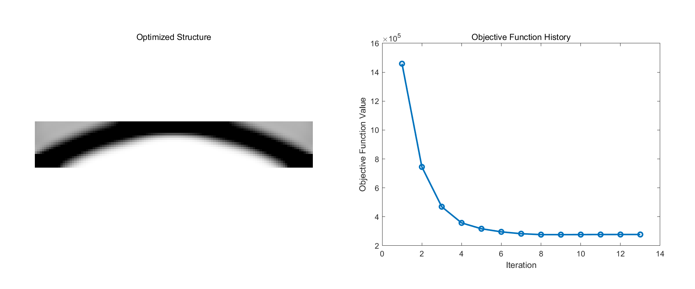

<script type="text/javascript" async
  src="https://cdn.jsdelivr.net/npm/mathjax@3/es5/tex-mml-chtml.js">
</script>
# Problem 2: Implement other boundary conditions

<p align="center">
  <figure align="center">
    
  </figure>
</p>

- Design Domain: A 2D rectangular plane, discretized into a grid of nelx=120 by nely=20 elements.
- Design Variables, objective function,  constraint are the same as Problem 1.

- Optimization parameters: The volume fraction is set to 0.5, the penalization factor is set to 3, the filter radius is set to 4.8, and the filter type is set to sensitivity filter.
## Two simultaneous point loads
- Loading Conditions: Two downward point loads are applied at the top edge of the design domain, specifically at the one-quarter and three-quarters positions. We compared the cases where the forces are applied upwards versus downwards.
```matlab
F(2*(nelx/4)*(nely+1)+2,1)=1; F(2*(3*nelx/4)*(nely+1)+2,1)=1;
```
### Case1
- Boundary Conditions: The nodes at the bottom left and right corners of the design domain are fully fixed, meaning that both the x and y degrees of freedom at these nodes are constrained.
```matlab
fixeddofs = [2*(nely+1)-1, 2*(nely+1), 2*(nelx+1)*(nely+1)-1, 2*(nelx+1)*(nely+1)];
```
<p align="center">
  <figure align="center">
    
  </figure>
</p>


### Case2
- Boundary Conditions: The nodes at the bottom left and right corners of the design domain are partially fixed, meaning that only the y degrees of freedom at these nodes are constrained, while the x degrees of freedom remain free.
```matlab
fixeddofs = [2*(nely+1), 2*(nelx+1)*(nely+1)];
```
<p align="center">
  <figure align="center">
    
  </figure>
</p>


## Distributed load
- Loading Conditions: A series of vertical forces are applied along the top edge of the design domain.
```matlab
for i = 1:nelx+1
    F(2*(i-1)*(nely+1)+2, 1) = -1;
end
```
### Case1
- Boundary Conditions: The nodes at the bottom left and right corners of the design domain are fully fixed, meaning that both the x and y degrees of freedom at these nodes are constrained.
```matlab
fixeddofs = [2*(nely+1)-1, 2*(nely+1), 2*(nelx+1)*(nely+1)-1, 2*(nelx+1)*(nely+1)];
```
<p align="center">
  <figure align="center">
    
  </figure>
</p>


### Case2
- Boundary Conditions: The nodes at the bottom left and right corners of the design domain are partially fixed, meaning that only the y degrees of freedom at these nodes are constrained, while the x degrees of freedom remain free.
```matlab
fixeddofs = [2*(nely+1), 2*(nelx+1)*(nely+1)];
```
<p align="center">
  <figure align="center">
    
  </figure>
</p>


## Analysis and Conclusion
- Experiments show that the direction of the force does not change the optimization results (identical result images are not displayed in the report to save space). In fact, from the perspective of theoretical derivation, \\(KU = F\\) is a linear equation. When \\(F\\) changes to \\(-F\\), \\(U\\) changes to \\(-U\\). However, the objective function \\(c\\) is a quadratic function of \\(U\\), so changing \\(U\\) to \\(-U\\) does not affect the value of \\(c\\), and thus does not influence the update process of \\(x\\) at each step.
- We applied a downward force component to each node in the first row under the distributed load condition. **Should we expect the material density at the points where the force is applied to be 1 in the optimization results?**
- In this problem, I chose the filter radius as rmin = nelx * 0.04 = 120 * 0.04 = 4.8 based on the experience from Assignment 1. However, I overlooked the fact that in this problem, I did not reduce the problem to half of the material based on symmetry, so the ratio of nelx to nely is 6, not 3. As a result, the filter radius rmin = 4.8 might be too large for nely, which could have led to large gray areas in the optimization results.
- In this problem, I discussed two boundary conditions: one where only the y components at the bottom-left and bottom-right corners are fixed, and another where both the x and y components are fixed. I'm not sure which boundary condition better reflects the actual physics. **How should we determine the boundary conditions in real-world problems?**
