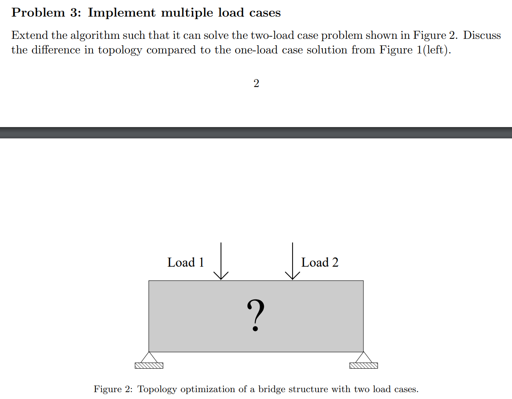
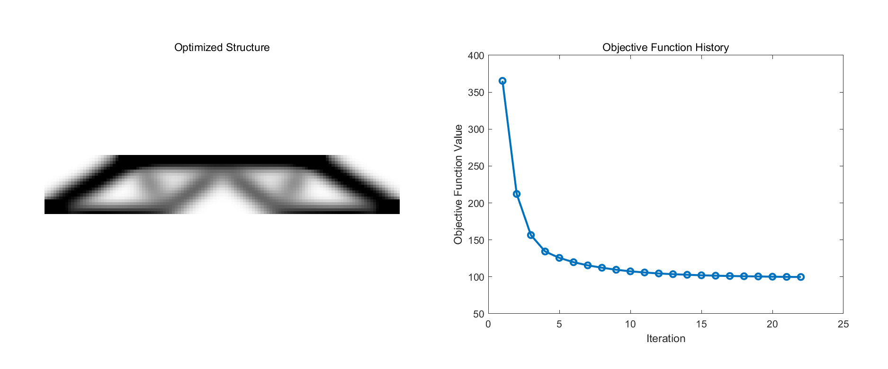

<script type="text/javascript" async
  src="https://cdn.jsdelivr.net/npm/mathjax@3/es5/tex-mml-chtml.js">
</script>
# Problem 3:  Implement multiple load cases

<p align="center">
  <figure align="center">
    
  </figure>
</p>

- Design Domain, design variables, objective function,  constraint, optimization parameters are the same as Problem 2.

## Implement
For the two load cases, we need to assign an external force column vector \\( F \\) and a displacement column vector \\( U \\) for each load.
```matlab
F = sparse(2*(nely+1)*(nelx+1),2);
F(2*(nelx/4)*(nely+1)+2,1)=-1;
F(2*(3*nelx/4)*(nely+1)+2,2)=-1;
U = zeros(2*(nely+1)*(nelx+1),2);
```
This is mathematically different from the single load case. Although \\( F = KU \\) is a linear equation, so \\( U_0 = U_1 + U_2 \\), where \\( U_0 \\) is the displacement column vector for the single load case and \\( U_1 \\) and \\( U_2 \\) are the displacement column vectors for the two load cases, \\( c \\) is a quadratic function of \\( U \\), so \\( c(U_0) \\) is not equal to \\( c(U_1) + c(U_2) \\).

```matlab
U(freedofs, 1) = K(freedofs, freedofs) \ F(freedofs, 1);  % Solve for the first load case
U(freedofs, 2) = K(freedofs, freedofs) \ F(freedofs, 2);  % Solve for the second load case
%% OBJECTIVE FUNCTION AND SENSITIVITY ANALYSIS
%% Compute ce for both loading conditions
for i = 1:nelx*nely
    Ue1 = U(edofMat(i, :), 1); % Extract element displacement vector for load case 1
    Ue2 = U(edofMat(i, :), 2); % Extract element displacement vector for load case 2
    ce1(i) = Ue1' * KE * Ue1; % Calculate strain energy density for load case 1
    ce2(i) = Ue2' * KE * Ue2; % Calculate strain energy density for load case 2
end

ce1 = reshape(ce1, nely, nelx);
ce2 = reshape(ce2, nely, nelx);

%% Compute c for both loading conditions and sum them up
c1 = sum(sum((Emin + xPhys.^penal * (E0 - Emin)) .* ce1));
c2 = sum(sum((Emin + xPhys.^penal * (E0 - Emin)) .* ce2));
c = c1 + c2;
objective_values = [objective_values; c]; % Store current objective value
% Compute dc for both loading conditions
dc1 = -penal * (E0 - Emin) * xPhys.^(penal - 1) .* ce1;
dc2 = -penal * (E0 - Emin) * xPhys.^(penal - 1) .* ce2;
dc = dc1 + dc2;
```
The other parts are the same as the original code.
## Results Comparison and Analysis
<p align="center">
  <figure align="center">
    
    <figcaption>Figure1: Two load case</figcaption>
  </figure>
</p>


<p align="center">
  <figure align="center">
    
    <figcaption>Figure2: One load case with two position nonzero</figcaption>
  </figure>
</p>
The optimized structure in the Two load case exhibits higher genus, a more complex topology, and poorer stiffness (the objective function value is 99.7439 in Figure 1, compared to 82.6921 in Figure 2). It is intuitively understandable that a more complex approach leads to a more complex topology. However, we cannot simply conclude that the One load case strategy is better than the Two load case strategy just because the compliance in Figure 2 is lower. Theoretically, the Two load case approach has a strictly greater expressive power than the One load case. Therefore, I believe there must be scenarios where the Two load case can better describe the actual physics.

## Source code
```matlab
function problem3()
    %% FIXED PARAMETERS
    nelx = 120;      % Fixed number of elements along x-axis
    nely = 20;       % Fixed number of elements along y-axis
    volfrac = 0.5;   % Fixed volume fraction
    penal = 3;       % Fixed penalization factor
    rmin = 4.8;      % Fixed filter radius
    ft = 1;          % Fixed filter type (sensitivity filter)

    %% MATERIAL PROPERTIES
    E0 = 1;
    Emin = 1e-9;
    nu = 0.3;

    %% PREPARE FINITE ELEMENT ANALYSIS
    A11 = [12  3 -6 -3;  3 12  3  0; -6  3 12 -3; -3  0 -3 12];
    A12 = [-6 -3  0  3; -3 -6 -3 -6;  0 -3 -6  3;  3 -6  3 -6];
    B11 = [-4  3 -2  9;  3 -4 -9  4; -2 -9 -4 -3;  9  4 -3 -4];
    B12 = [ 2 -3  4 -9; -3  2  9 -2;  4  9  2  3; -9 -2  3  2];
    KE = 1/(1-nu^2)/24*([A11 A12;A12' A11]+nu*[B11 B12;B12' B11]);
    nodenrs = reshape(1:(1+nelx)*(1+nely),1+nely,1+nelx);
    edofVec = reshape(2*nodenrs(1:end-1,1:end-1)+1,nelx*nely,1);
    edofMat = repmat(edofVec,1,8)+repmat([0 1 2*nely+[2 3 0 1] -2 -1],nelx*nely,1);
    iK = reshape(kron(edofMat,ones(8,1))',64*nelx*nely,1);
    jK = reshape(kron(edofMat,ones(1,8))',64*nelx*nely,1);

    %% DEFINE LOADS AND SUPPORTS (HALF MBB-BEAM)
    F = sparse(2*(nely+1)*(nelx+1),2);
    F(2*(nelx/4)*(nely+1)+2,1)=-1;
    F(2*(3*nelx/4)*(nely+1)+2,2)=-1;
    U = zeros(2*(nely+1)*(nelx+1),2);
    fixeddofs = [2*(nely+1)-1,2*(nely+1),2*(nelx+1)*(nely+1)-1, 2*(nelx+1)*(nely+1)]; % xy分量都固定
    alldofs = [1:2*(nely+1)*(nelx+1)];
    freedofs = setdiff(alldofs,fixeddofs);

    %% PREPARE FILTER
    iH = ones(nelx*nely*(2*(ceil(rmin)-1)+1)^2,1);
    jH = ones(size(iH));
    sH = zeros(size(iH));
    k = 0;
    for i1 = 1:nelx
        for j1 = 1:nely
            e1 = (i1-1)*nely+j1;
            for i2 = max(i1-(ceil(rmin)-1),1):min(i1+(ceil(rmin)-1),nelx)
                for j2 = max(j1-(ceil(rmin)-1),1):min(j1+(ceil(rmin)-1),nely)
                    e2 = (i2-1)*nely+j2;
                    k = k+1;
                    iH(k) = e1;
                    jH(k) = e2;
                    sH(k) = max(0,rmin-sqrt((i1-i2)^2+(j1-j2)^2));
                end
            end
        end
    end
    H = sparse(iH,jH,sH);
    Hs = sum(H,2);

    %% INITIALIZE ITERATION
    x = repmat(volfrac,nely,nelx);
    xPhys = x;
    loop = 0;
    change = 1;
    objective_values = []; % Array to store objective function values

    %% START ITERATION
    while change > 0.01
        loop = loop + 1;
        %% FE-ANALYSIS
        sK = reshape(KE(:)*(Emin+xPhys(:)'.^penal*(E0-Emin)),64*nelx*nely,1);
        K = sparse(iK,jK,sK); K = (K+K')/2;
        U(freedofs, 1) = K(freedofs, freedofs) \ F(freedofs, 1);  % Solve for the first load case
        U(freedofs, 2) = K(freedofs, freedofs) \ F(freedofs, 2);  % Solve for the second load case

        %% OBJECTIVE FUNCTION AND SENSITIVITY ANALYSIS
        % Compute ce for both loading conditions
        ce1 = zeros(nely, nelx);
        ce2 = zeros(nely, nelx);
        for i = 1:nelx*nely
            Ue1 = U(edofMat(i, :), 1); % Extract element displacement vector for load case 1
            Ue2 = U(edofMat(i, :), 2); % Extract element displacement vector for load case 2
            ce1(i) = Ue1' * KE * Ue1; % Calculate strain energy density for load case 1
            ce2(i) = Ue2' * KE * Ue2; % Calculate strain energy density for load case 2
        end

        ce1 = reshape(ce1, nely, nelx);
        ce2 = reshape(ce2, nely, nelx);

        % Compute c for both loading conditions and sum them up
        c1 = sum(sum((Emin + xPhys.^penal * (E0 - Emin)) .* ce1));
        c2 = sum(sum((Emin + xPhys.^penal * (E0 - Emin)) .* ce2));
        c = c1 + c2;
        objective_values = [objective_values; c]; % Store current objective value

        % Compute dc for both loading conditions
        dc1 = -penal * (E0 - Emin) * xPhys.^(penal - 1) .* ce1;
        dc2 = -penal * (E0 - Emin) * xPhys.^(penal - 1) .* ce2;
        dc = dc1 + dc2;

        dv = ones(nely, nelx);

        %% FILTERING/MODIFICATION OF SENSITIVITIES
        if ft == 1
            dc(:) = H*(x(:).*dc(:))./Hs./max(1e-3,x(:));
        elseif ft == 2
            dc(:) = H*(dc(:)./Hs);
            dv(:) = H*(dv(:)./Hs);
        end

        %% OPTIMALITY CRITERIA UPDATE OF DESIGN VARIABLES AND PHYSICAL DENSITIES
        l1 = 0; l2 = 1e9; move = 0.2;
        while (l2-l1)/(l1+l2) > 1e-3
            lmid = 0.5*(l2+l1);
            xnew = max(0,max(x-move,min(1,min(x+move,x.*sqrt(-dc./dv/lmid)))));
            if ft == 1
                xPhys = xnew;
            elseif ft == 2
                xPhys(:) = (H*xnew(:))./Hs;
            end
            if sum(xPhys(:)) > volfrac*nelx*nely, l1 = lmid; else l2 = lmid; end
        end
        change = max(abs(xnew(:)-x(:)));
        x = xnew;

        %% PRINT RESULTS
        fprintf(' It.:%5i Obj.:%11.4f Vol.:%7.3f ch.:%7.3f\n',loop,c, mean(xPhys(:)),change);
    end

    %% PLOT DENSITIES AND OBJECTIVE FUNCTION HISTORY
    figure('Position', [100, 100, 1200, 500]);  % 增加图像的宽度，将整张图像拉长

    % 调整结构图像的大小和位置
    subplot('Position', [0.05, 0.15, 0.4, 0.7]);  % 调整位置和大小 [左, 下, 宽, 高]
    colormap(gray);
    imagesc(1-xPhys); 
    caxis([0 1]); 
    axis equal; 
    axis off; 
    title('Optimized Structure');

    % 调整目标函数历史图像的大小和位置
    subplot('Position', [0.55, 0.15, 0.4, 0.7]);  % 调整位置和大小 [左, 下, 宽, 高]
    plot(1:loop, objective_values, '-o', 'LineWidth', 2);  % 使用 -o 添加数据点标记
    xlabel('Iteration');
    ylabel('Objective Function Value');
    title('Objective Function History');

    % 保存图像
    save_filename = sprintf('result_two_load_cases_both_xy_loop%d_obj%.4f.png', loop, c);
    saveas(gcf, save_filename);
    close all;
end
```
