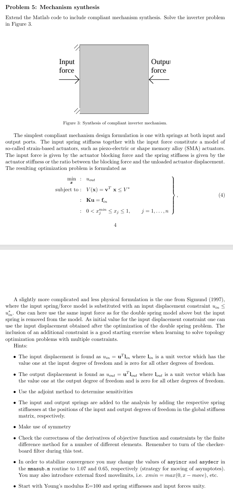
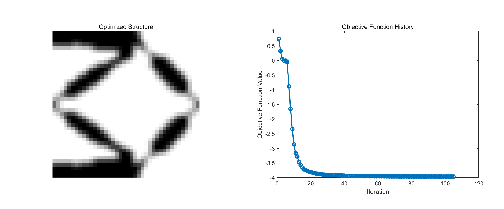
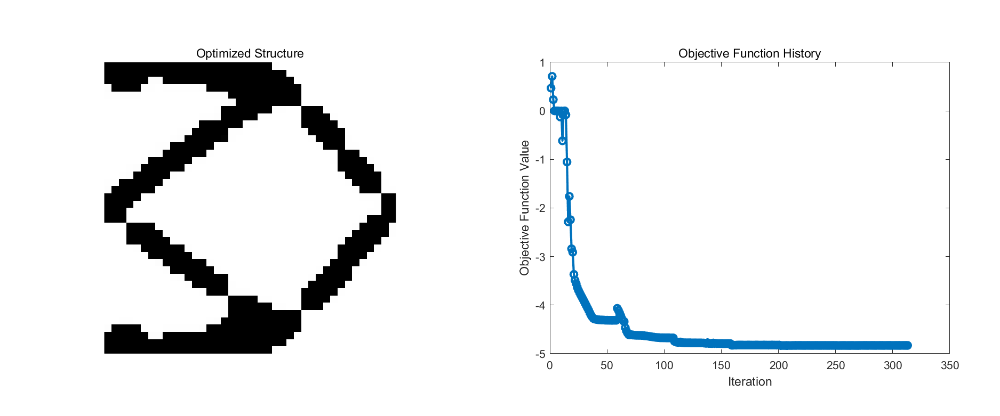

<script type="text/javascript" async
  src="https://cdn.jsdelivr.net/npm/mathjax@3/es5/tex-mml-chtml.js">
</script>
# Problem 5:  Mechanism synthesis
<figure align="center">
    
</figure>
The goal of this problem is to achieve the following optimized structure: when a specified force is applied at a designated location, a specified displacement occurs at another designated location. This problem helps us design components that undergo the expected deformation under the anticipated loading conditions.

- **Design domain**: A square. In the code, we set nelx = nely = 40.
- **Boundary conditions**: According to the image, we fix the nodes at the top left and bottom left corners.
```matlab
fixeddofs = union([1:2], [2*(nely+1)-1,2*(nely+1)]);
```
- **Loading conditions**: According to the image, we apply a force to the right at the middle node of the leftmost column.
```matlab
din=2*ceil((nely+1)/2)-1;
F = sparse(din,1,1,2*(nely+1)*(nelx+1),1);
```
- **Objective Function**：According to the image, we expect the middle node of the rightmost column to have a displacement to the left.
```matlab
dout = 2*(nelx)*(nely+1)+2*ceil((nely+1)/2)-1;
c = U(dout);
```
- **Sensitivity Analysis**: In this assignment, we use the adjoint method to calculate sensitivity.

\[
\hat{\Phi} = \Phi + \lambda^T(KU - F)
\]

\\(\hat{\Phi}\\) and \\(\Phi\\) are numerically the same because \\(KU-F=0\\). Taking the derivative of \(\hat{\Phi}\) we get

\[
\hat{\Phi}' = \frac{\partial \Phi}{\partial U} U' + \lambda^T (K'U + K U')
\]

If we can take \\(\lambda\\) such that

\[
\lambda^T K + \frac{\partial \Phi}{\partial U} = 0\Longleftrightarrow K^T \lambda = - \left(\frac{\partial \Phi}{\partial U}\right)^T
\]

Then

\[
\Phi'=\hat{\Phi}' = \lambda^T K'U.
\]

The above process is reflected in the code as
```matlab
L(dout)=1;
Lambda(freedofs) = -K(freedofs,freedofs)\L(freedofs);
ce = reshape(sum((Lambda(edofMat)*KE).*U(edofMat),2),nely,nelx);
dc = penal*(E0-Emin)*xPhys.^(penal-1).*ce;
```
- **Input and Output springs**: According to the hints, we added additional springs at the input and output positions.
```matlab
K(din,din) = K(din,din) + In_spring;
K(dout,dout) = K(dout,dout) + Out_spring;
```
We can adjust the stiffness coefficient of the springs through two parameters, In_spring and Out_spring.

## Results and Analysis
<figure align="center">
    
    <figcaption>Figure 1: Using Density Filtering</figcaption>
</figure>
<figure align="center">
    
    <figcaption>Figure 2: Using Heaviside Projection</figcaption>
</figure>

It can be observed that the optimization results generated by the two methods have similar structures, especially with joint-like structures appearing in the same locations. It can be imagined that these positions would be parts in the actual manufactured device where the direction of force is altered during the process of force transmission.

We implemented the Heaviside projection using the top110 code from the official website. After applying the Heaviside projection, we obtained the expected binary images of 0s and 1s, effectively eliminating grayscale. It is notable that post Heaviside projection, we achieved a lower objective function value of -4.8295 compared to -3.9642 with Density Filtering. Additionally, we observed abrupt increases in the objective function at certain locations after employing the Heaviside projection. This adjustment in the parameter \beta, doubling it periodically during the iterations, accelerates the convergence towards the binary images. I must acknowledge that the code is not yet robust enough; when using Heaviside projection with larger nelx and nely values, the optimization results are not as intended. I plan to meticulously analyze the Heaviside projection algorithm to determine necessary adjustments for improved outcomes.

