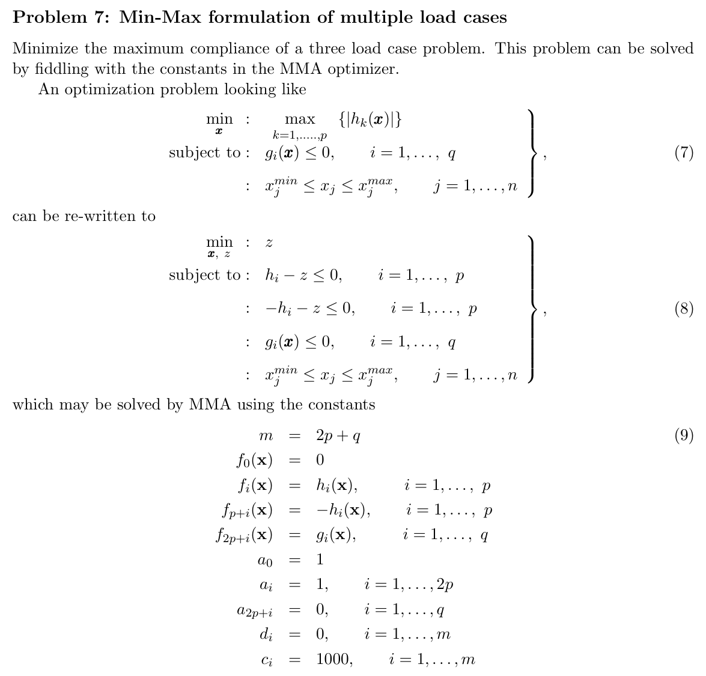
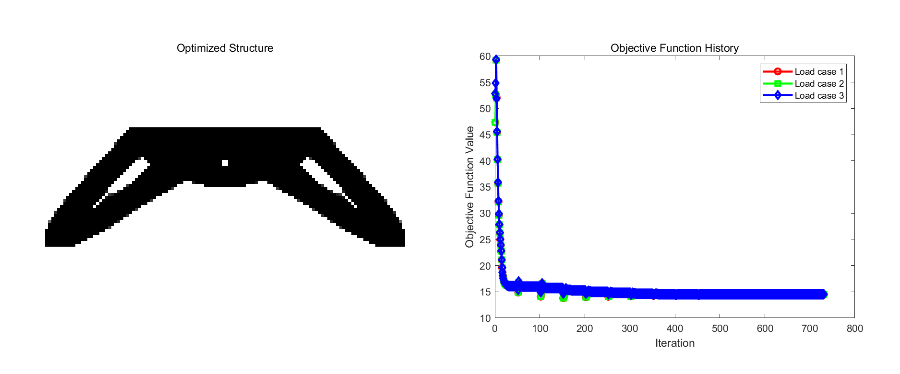

<script type="text/javascript" async
  src="https://cdn.jsdelivr.net/npm/mathjax@3/es5/tex-mml-chtml.js">
</script>
# Problem 7:  Mechanism synthesis
<figure align="center">
    
</figure>
This problem is relatively simple because we have already dealt with multi-load cases in Assignment 3, and we have extensively analyzed the MMA method in Assignment 4. Therefore, both the problem to be solved and the method to solve it are already very familiar to us.

The purpose of this problem is to minimize the maximum compliance of the structure under different loads, that is, to find the optimal material distribution within a given volume constraint so that the structure deforms minimally under various force applications.

- **Objective Function**：The constraint conditions h_i - z \leqslant 0 and -h_i - z \leqslant 0 actually imply that z \geqslant |h_i|. In this way

$$
z=\max_{k=1,\cdots,p} \lbrace |h_k(x)| \rbrace
$$

In the code, we let
```matlab
fval(1:p) = c(1:p);  fval(p+1:2*p) = -c(1:p);
```
- **Design domain**: A triangle with nelx = 120 and nely = 40 representating a bridge.
- **Boundary conditions**: The nodes at the bottom left and right corners of the design domain are fully fixed
```matlab
fixeddofs = [2*(nely+1)-1, 2*(nely+1), 2*(nelx+1)*(nely+1)-1, 2*(nelx+1)*(nely+1)];
```
- **Loading conditions**: We apply a downward force at the first quarter node, the third quarter node, and the midpoint as three types of loads. This simulates different positions of a vehicle driving on the bridge in the real world.
```matlab
total_dofs = 2*(nely+1)*(nelx+1);  
multiple_load_cases = 3;
F = sparse(total_dofs, multiple_load_cases);
F(2*(nely+1)*(nelx/4) + 2, 1) = -1; 
F(2*3*(nely+1)*(nelx/4)+2, 2) = -1;
F(2*(nely+1)*(nelx/2) + 2, 3) = -1;  
```
- **Optimization parameters**: volfrac=0.5; penal=3.0; rmin=3.6; 

## Results and Analysis
 <figure align="center">
    
    <figcaption>Figure 1: Using MMA & Formulation in Assignment 7</figcaption>
</figure>

The shortcoming of this assignment is the lack of sufficient examples in mind, failing to come up with appropriate three load cases that possess practical physical significance. The three curves presented in the assignment example show minimal differences.

Another area for improvement is to compare the explanation of the optimization problem in this assignment with the approach in Assignment 3, where the objective function is a weighted sum of three individual objective functions.
